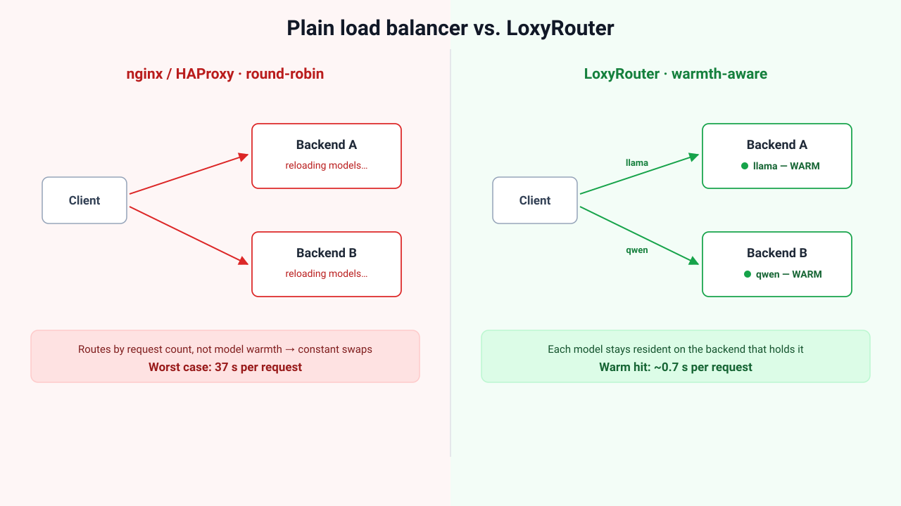
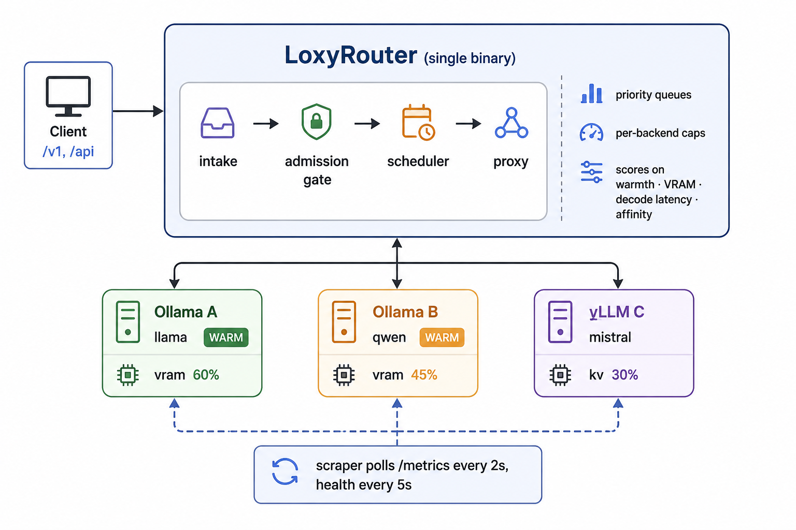

<div align="center">

# LoxyRouter

### Warmth-aware router for self-hosted LLM inference

**LoxyRouter sits in front of your Ollama and vLLM backends and routes each request to the instance that can answer it fastest — the one that already has the model loaded.** One model swap costs tens of seconds; LoxyRouter's job is to make sure you almost never pay it.

[](https://go.dev)
[](#quickstart)
[](LICENSE)
[](#whats-validated)

</div>

---

## The problem

Run more than one model on your own GPUs and you hit a wall the cloud APIs hide from you: **only so many models fit in VRAM at once.** When a request arrives for a model that isn't loaded, the backend evicts another model and cold-loads the new one. On real hardware that stall is **25–120 seconds** — for a *single* request.

A naive round-robin or least-connections load balancer makes this *worse*: it scatters requests across backends, so every backend keeps evicting and reloading the same models. The GPUs spend their time swapping weights instead of generating tokens.

<p align="center">
  
</p>

LoxyRouter keeps each model **pinned to where it's already hot** and routes around the swap.

---

## Why LoxyRouter

- **Warmth-aware routing** — prefers the backend where your model is already resident, so you skip the cold-load stall. This is the whole point.
- **Learns real decode speed** — scores backends on measured per-token latency (decode only, excluding one-time load/prompt cost), so a backend that just cold-loaded doesn't look "slow" and get starved.
- **VRAM guard** — refuses to route to a backend near its memory ceiling *before* it OOMs. A fast 503 beats a crash that kills every in-flight request.
- **Conversation affinity** — pins a conversation to the backend holding its KV cache, so multi-turn chats reuse context instead of recomputing it.
- **Priority admission control** — three tiers (`interactive` > `batch` > `background`) with per-tier queue caps; sheds load with a fast 503 instead of melting down.
- **Hard per-backend concurrency caps** — atomic reservation means a backend's limit is a ceiling, not a suggestion.
- **Drop-in compatible** — speaks the OpenAI (`/v1/*`) and Ollama (`/api/*`) APIs and passes bodies through untouched. Point your existing client at LoxyRouter with a one-line URL change.
- **Custom routing without forking** — implement a one-method `SchedulerPlugin` to override routing for any model; fall through to the built-in logic by returning empty.
- **Prometheus-native** — `/metrics`, `/status`, `/health` out of the box. Pull-based scraping of your backends; no agent to install.
- **One Go binary, zero infrastructure** — no database, no Kubernetes, no sidecar. Runs in five minutes.

---

## Quickstart

```bash
# Install with Go (or grab a prebuilt binary from the Releases page)
go install github.com/mageshkrishna/loxy-router@latest

# Or build from source (single static binary, no CGO)
git clone https://github.com/mageshkrishna/loxy-router && cd loxy-router
go build -o loxy-router .

# Zero-config: auto-discovers Ollama on localhost:11434–11437
./loxy-router

# Or point it at your backends
./loxy-router -config config.yaml
```

Send it traffic exactly like you would Ollama or vLLM:

```bash
curl localhost:8080/v1/chat/completions \
  -H "Content-Type: application/json" \
  -d '{"model":"llama3.2:1b","messages":[{"role":"user","content":"hi"}]}'
```

> **Heads-up:** vLLM strictly requires `Content-Type: application/json`. LoxyRouter forwards your headers verbatim — it never rewrites request bodies — so set the header on the client (Ollama is lenient; vLLM is not).

### Verify it's working

```bash
curl localhost:8080/health
# {"status":"ok"}

# Live routing state (add -H "Authorization: Bearer <key>" if api_keys is set)
curl localhost:8080/status
```

A healthy `/status` shows every backend `"status": "up"`, with `warm` and `loaded_models` reflecting what's resident in VRAM:

```json
{
  "gate": { "max_inflight": 64, "inflight": 0, "queued": { "interactive": 0, "batch": 0, "background": 0 } },
  "backends": [
    {
      "name": "ollama-gpu",
      "url": "http://localhost:11434",
      "type": "ollama",
      "status": "up",
      "warm": true,
      "loaded_models": ["llama3.2:1b"],
      "vram_used_pct": 0.31,
      "queue_depth": 0,
      "inflight": 0,
      "effective_concurrent": 8,
      "per_token_ms": 18,
      "last_scraped": "2026-06-10T12:00:00Z"
    }
  ]
}
```

A backend stuck at `"status": "down"` means LoxyRouter can't reach it — check the `url` in your config and that the backend is up.

> **Running multiple GPUs?** Ollama won't load the same model on more than one GPU ([ollama#9054](https://github.com/ollama/ollama/issues/9054)); the fix is one Ollama instance per GPU with a router in front. See [`examples/multi-gpu-ollama`](examples/multi-gpu-ollama) for a ready-to-run Docker Compose setup.

---

## Configuration

```yaml
listen: ":8080"

backends:
  - name: ollama-gpu
    url: "http://localhost:11434"
    type: ollama                 # "ollama" (default) or "vllm"
    vram_total_mb: 24576         # enables the VRAM guard for Ollama
    max_concurrent: 8            # hard cap; 0 = auto-size from free VRAM
    models: [llama3.2:1b]        # which models this backend serves (empty = any)

  - name: vllm-a100
    url: "http://gpu-box:8000"
    type: vllm                   # VRAM/queue read from vLLM's /metrics directly
    max_concurrent: 32
    models: [mistral-7b]

# Inbound auth: required on every /v1, /api, /status request when set.
# ALWAYS set this if LoxyRouter is reachable beyond localhost.
api_keys: ["sk-your-secret"]

# Outbound auth: credential LoxyRouter presents to backends (e.g. vLLM --api-key).
# Client Authorization is stripped so client keys never leak downstream.
backend_api_key: "backend-shared-secret"

# Per-priority queue depth before new arrivals of that tier get a fast 503.
queue:
  interactive: 50
  batch: 200
  background: 100

# Network deadlines (optional; defaults shown). Bound a dead backend without
# truncating long streams.
timeouts:
  response_header_secs: 120      # max wait for backend headers; streams unbounded after
  shutdown_secs: 30              # graceful drain window on SIGTERM
```

**Clients steer routing with headers:**

| Header | Effect |
|---|---|
| `X-Priority: interactive\|batch\|background` | Admission tier (default `interactive`) |
| `X-Conversation-Id: <stable-id>` | Pins the conversation to one backend for KV-cache reuse |

Zero-config auto-discovery also reads `SCHEDULER_BACKENDS=http://host1:11434,http://host2:11434`.

---

## How routing works

For each request, LoxyRouter scores every eligible backend and picks the best:

1. **Filter** — drop backends that don't serve the model, are unhealthy, or are above the VRAM guard threshold (90%).
2. **Affinity** — if the conversation is pinned to a healthy backend, prefer it (KV-cache reuse).
3. **Score** — higher is better:
   - **warm** backend: `1 / ((load + 1) × per_token_ms)`
   - **cold** backend: `1 / (cold_load_ms + load × per_token_ms)` — bakes the ~25s reload penalty into the score, so a warm backend wins unless it's badly overloaded.
4. **Reserve** — atomically claim a concurrency slot (compare-and-swap under the cap). Lose the race? Exclude and re-pick. The cap is never exceeded.

Per-token latency is measured **decode-only** — from the engine's own `eval_duration` (Ollama) or the first-token→last-token window — so model load, prompt processing, and queue wait never pollute the routing signal.

---

## API

| Endpoint | Auth | Purpose |
|---|---|---|
| `POST /v1/*` | Required | OpenAI-compatible proxy (chat, completions, embeddings…) |
| `POST /api/*` | Required | Ollama-native proxy |
| `GET /status` | Required | Live backend state: warmth, VRAM, queue, inflight, per-token latency |
| `GET /metrics` | Open | Prometheus exposition (for scraping) |
| `GET /health` | Open | Liveness probe (for load balancers) |

`/metrics` exposes per-backend per-token latency, request counts by status, gate inflight/queue depth, and VRAM/warmth — ready for Grafana.

---

## Running in production

LoxyRouter is a single binary. What it handles for you, and what you put in front of it:

- **Run a single instance (for now).** All state — backend health, queue depth, latency history, conversation affinity — is in-memory. Run **one** instance behind your load balancer. Two instances won't share affinity or admission state. Horizontal scaling with shared Redis state is on the [roadmap](#roadmap).
- **Terminate TLS in front of it.** LoxyRouter speaks plain HTTP. Put it behind nginx, Caddy, a cloud LB, or a k8s ingress. Don't expose it to the internet directly.
- **Set `api_keys`** the moment it's reachable beyond `localhost`.
- **Timeouts are handled.** No overall request timeout (streams run for minutes), but connect (5s), TLS (10s), response-header wait (`response_header_secs`), and idle keep-alive (90s) are all bounded so a dead backend can't pin a goroutine. The server sets `ReadHeaderTimeout` (closes the Slowloris hole) and deliberately *no* write timeout.
- **Graceful shutdown.** On `SIGTERM`/`SIGINT` LoxyRouter stops accepting connections and drains in-flight streams for up to `shutdown_secs` before exiting — set your orchestrator's termination grace period to match.
- **Capacity & backpressure.** Set `max_concurrent` per backend to its real capacity (Ollama on GPU ≈ 4–8, vLLM on an A100 ≈ 30–50, CPU ≈ 1–2). When all backends are full, requests wait in priority order up to the `queue:` limits, then get a fast 503.

---

## What's validated

Tested on a rented **NVIDIA A40 (48 GB)** with real Ollama and vLLM 0.11.0 backends:

| Claim | Result |
|---|---|
| **Warmth routing eliminates thrash** | Cold load **37 s** → warm hit **~0.7 s** for the same request |
| **Proxy overhead is negligible** | **+8 ms** p50, ~0 at p95 vs. hitting the backend directly |
| **Robust under load** | 0 errors across ~450 concurrent requests; admission gate always settled to 0 |
| **Memory is bounded** | RSS scales linearly with concurrency × body size; no leak (10 MB idle → 125 MB at 100×512 KB) |
| **vLLM path** | `/v1/models` discovery, KV-cache guard signal, and failover/self-heal all confirmed live |

> LoxyRouter is a thin, transparent layer — throughput is whatever your backends can do. Its value is *which* backend it picks, not raw speed.

---

## Architecture

<p align="center">
  
</p>

A background scraper pulls each backend's `/metrics` (vLLM) or `/api/ps` (Ollama) into an in-memory state store; the scheduler reads that store to score routing decisions. Nothing is pushed to LoxyRouter — any stock Ollama or vLLM works unmodified.

---

## Design decisions

- **Single binary, no sidecar.** No config service, no service mesh. Operators run it like any other tool.
- **Protocol-transparent.** LoxyRouter never modifies request or response bodies. Any client that works with Ollama or vLLM works with LoxyRouter after a URL change.
- **In-memory state, not a database.** Backend state is ephemeral by design — on restart, backends re-register on the next health tick. No migrations, no persistence layer.
- **Pull-based metrics.** LoxyRouter scrapes backends rather than requiring them to report in, so backends need zero modification.
- **Pessimistic VRAM guard.** Reject *before* OOM, not after. A 503 to one request is far cheaper than a crash that kills every in-flight request on that GPU.
- **Best-effort KV locality.** Affinity degrades gracefully to least-queue routing if a backend dies — never to an error.

---

## Roadmap

Shipped today: warmth-aware routing, VRAM guard, decode-latency learning, conversation affinity, priority admission, per-backend caps, health/failover, Prometheus metrics, auth, graceful shutdown.

Planned:

- **Multi-instance** — shared state in Redis so affinity and admission survive horizontal scaling.
- **Predictive pre-warming** — watch per-model request rate and load a model on an idle backend *before* the traffic arrives.
- **Cloud fallback** — spill to OpenAI/Anthropic when every local backend is saturated.
- **Admin API** — drain/fill backends, force model loads, inspect queues at runtime.
- **OpenTelemetry tracing** — per-request spans across intake → scheduler → proxy.

---

## License

Apache 2.0 — see [LICENSE](LICENSE).
